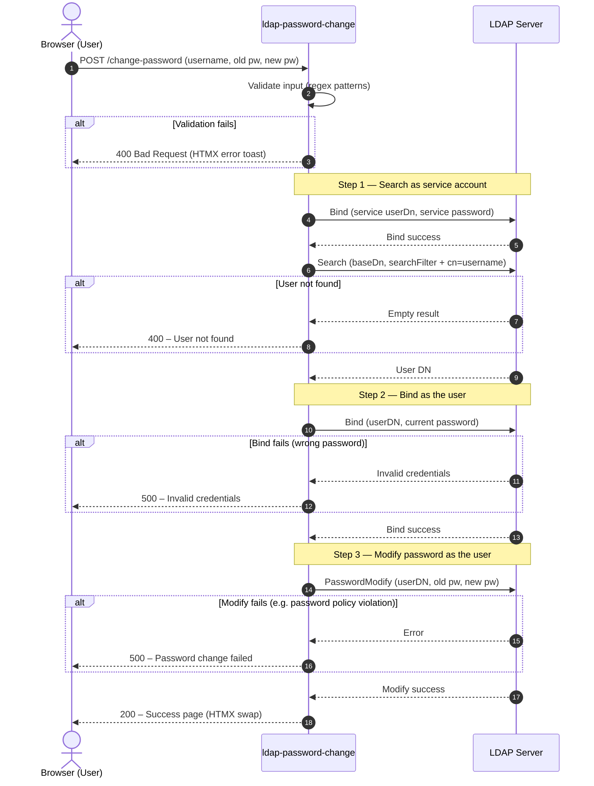
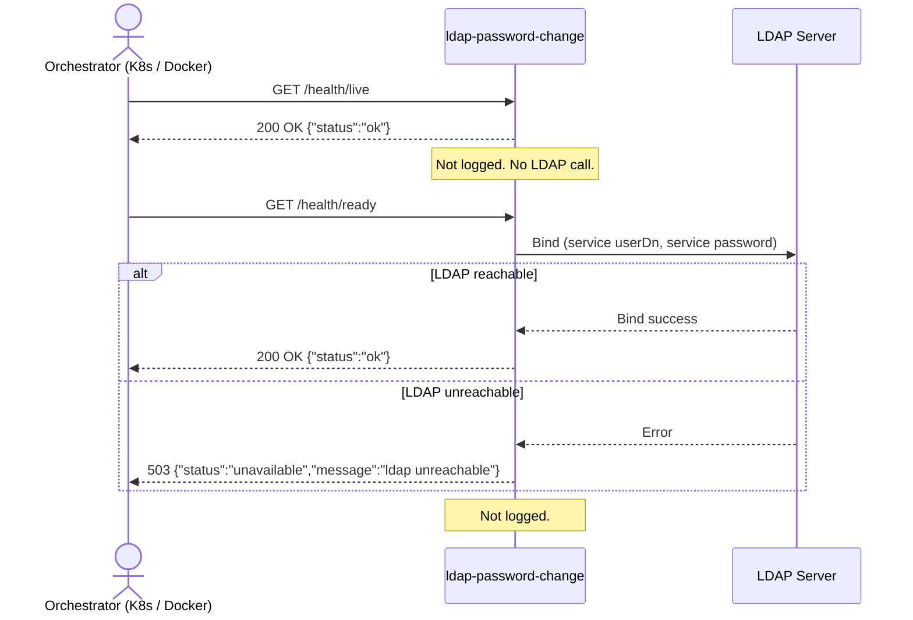

# Architecture

## Overview

`ldap-password-change` is a stateless Go HTTP service with a single purpose: allowing users to change
their LDAP password via a web browser. It contains no database and holds no session state.

```text
Browser  ──►  Chi HTTP Router  ──►  Handler  ──►  LDAP Service  ──►  LDAP Server
                    │
                    ├── GET  /              → Render HTML form (Templ)
                    ├── POST /change-password → Validate + Search-then-Bind + PasswordModify
                    ├── GET  /health/live   → Liveness probe (no LDAP call, not logged)
                    ├── GET  /health/ready  → Readiness probe (LDAP ping, not logged)
                    ├── GET  /static/*      → Bundled CSS/JS assets
                    └── GET  /custom/*      → User-mounted assets
```

## Component Breakdown

| Package                              | Responsibility                                          |
|--------------------------------------|---------------------------------------------------------|
| `cmd/config`                         | YAML + ENV configuration loading and merging            |
| `internal/handler/index`             | Serves the main HTML page via Templ                     |
| `internal/handler/change-password`   | Handles password change form submissions                |
| `internal/handler/health`            | Liveness (`/health/live`) and Readiness (`/health/ready`) probes |
| `internal/handler/static-files`      | Serves static assets with Brotli/Gzip compression      |
| `internal/service/ldap`              | Encapsulates all LDAP operations (Search-then-Bind)     |
| `internal/middleware`                | Chi middleware: structured request logging              |
| `internal/validation`                | Regex-based input validation                            |
| `views`                              | Templ UI components (compiled to Go)                    |

## Request Flow — Password Change (Search-then-Bind)

The service implements the **Search-then-Bind** pattern. The service account is only used to locate the
user's real DN; every password operation is then performed on a connection authenticated as the **user
themselves**, so the LDAP server enforces its own password policies.



## Request Flow — Health Probes



## Tech Stack

| Layer       | Technology                                       |
|-------------|--------------------------------------------------|
| Language    | Go 1.24+                                         |
| Router      | [Chi](https://github.com/go-chi/chi)             |
| UI Engine   | [Templ](https://templ.guide/)                    |
| UI Runtime  | [Alpine.js](https://alpinejs.dev/) + HTMX        |
| CSS         | Bootstrap 5.3 + custom glassmorphism layer       |
| LDAP        | [go-ldap/ldap](https://github.com/go-ldap/ldap)  |
| Logging     | `log/slog` (structured JSON)                     |
| Config      | YAML + env via `kelseyhightower/envconfig`       |

## Security Notes

- The service **never logs passwords** or bind credentials.
- The service account bind is used **only** to search for the user's real DN — it is never used to
  perform the password change itself.
- All password operations are performed on a connection **authenticated as the user**, so the LDAP
  server's own password policies (history, complexity, minimum age) are fully enforced.
- TLS is enforced in production via `ldap.ignoreTLS: false` and a trusted CA cert.

## LDAP Permissions Required

The service account (`ldap.userDn`) only needs:

| Permission      | Scope                     | Why                                            |
|-----------------|---------------------------|------------------------------------------------|
| **Bind** (auth) | Service account DN itself | To establish the search connection             |
| **Read** `dn`   | Subtree under `baseDn`    | To locate the user entry via `searchFilter`    |

The service account does **not** need write access to `userPassword`. The password change is performed
by the user's own authenticated connection, relying on the LDAP server's built-in ACLs.
